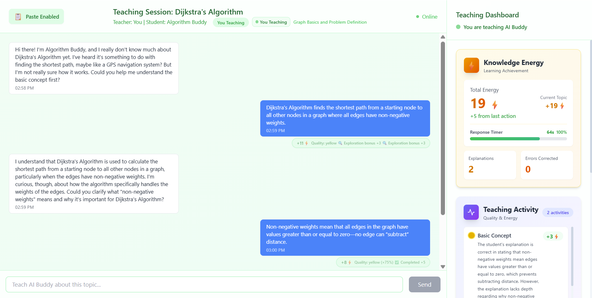

# 🎓 Learning by Teaching - AI Collaborative Learning Platform

An innovative AI-powered educational platform based on the **"Learning by Teaching"** pedagogy. Students and an AI buddy take turns being the teacher and learner, creating a collaborative learning experience that deepens understanding through active explanation and questioning.

<p align="center">
  
</p>


## 🌟 Key Features

### 🤝 Collaborative Learning Mode
- **Role Alternation**: AI and student take turns being the teacher
- **Active Learning**: Explaining concepts reinforces understanding
- **Intelligent Assessment**: Real-time evaluation of teaching quality and depth
- **Dynamic Feedback**: AI adapts its responses based on student's explanations

### 📚 Supported Algorithms
| Algorithm | Topics Covered |
|-----------|----------------|
| **Dijkstra's Algorithm** 🗺️ | Shortest path, non-negative weights, priority queue, edge relaxation, complexity |
| **Quick Sort** ⚡ | Divide & conquer, pivot selection, partitioning, recursion, complexity analysis |
| **Merge Sort** 🔀 | Split strategy, merge process, recursive structure, space complexity, stability |

### 🎮 Interactive Features
- Real-time WebSocket communication
- Visual progress tracking with energy system
- Knowledge point breakdown with sub-items
- Dynamic UI themes based on learning phase
- Certificate generation upon completion

## 🏗️ Project Architecture

```
semester_project_epfl/
├── backend/                    # Python FastAPI Backend
│   ├── main.py                # Main server & WebSocket handling
│   ├── teaching_flow.py       # Teaching flow management
│   ├── knowledge_points.py    # Algorithm knowledge definitions
│   ├── knowledge_energy.py    # Energy system management
│   └── llm_service.py         # OpenAI GPT-4 integration
├── frontend/                   # Vue 3 + TypeScript Frontend
│   ├── src/
│   │   ├── components/
│   │   │   ├── Dashboard.vue  # Learning progress dashboard
│   │   │   └── Certificate.vue # Completion certificate
│   │   ├── views/
│   │   │   └── ChatView.vue   # Main chat learning interface
│   │   └── router/
│   └── vite.config.ts
├── requirements.txt            # Python dependencies
├── start_backend.py           # Backend startup script
└── start_frontend.bat/.sh     # Frontend startup scripts
```

## 🛠️ Tech Stack

### Backend
- **FastAPI** - High-performance async web framework
- **OpenAI GPT-4** - AI dialogue generation and evaluation
- **WebSockets** - Real-time bidirectional communication
- **Pydantic** - Data validation and serialization

### Frontend
- **Vue 3** - Progressive JavaScript framework with Composition API
- **TypeScript** - Type-safe development
- **Vite** - Fast build tool and dev server
- **Tailwind CSS** - Utility-first CSS framework
- **Lucide Vue** - Beautiful icon library

## 🚀 Quick Start

### Prerequisites
- Python 3.9+
- Node.js 16+
- OpenAI API Key

### 1. Clone the Repository
```bash
git clone https://github.com/jerry-jiang0402/Learning_by_Teaching.git
cd Learning_by_Teaching
```

### 2. Configure Environment Variables
Create a `.env` file in the project root:
```bash
OPENAI_API_KEY=your_openai_api_key_here
OPENAI_BASE_URL=https://api.openai.com/v1  # Optional: custom endpoint
OPENAI_MODEL=gpt-4
OPENAI_TEMPERATURE=0.7
OPENAI_MAX_TOKENS=1000
```

### 3. Install & Start Backend
```bash
pip install -r requirements.txt
python start_backend.py
```
Backend runs at `http://localhost:8000`

### 4. Install & Start Frontend
**Windows:**
```bash
cd frontend
npm install
npm run dev
```

**Or use the startup script:**
```bash
start_frontend.bat  # Windows
./start_frontend.sh # Linux/Mac
```
Frontend runs at `http://localhost:5173`

### 5. Start Learning!
1. Open `http://localhost:5173` in your browser
2. Select an algorithm to learn
3. Engage with your AI buddy in collaborative teaching!

## 📖 How It Works

### The Learning Flow

```
┌─────────────────────────────────────────────────────────────┐
│  1. SELECT ALGORITHM                                         │
│     Choose from Dijkstra, Quick Sort, or Merge Sort         │
├─────────────────────────────────────────────────────────────┤
│  2. AI BUDDY TEACHES                                         │
│     AI explains the first knowledge point                   │
│     Student asks questions and demonstrates understanding   │
├─────────────────────────────────────────────────────────────┤
│  3. STUDENT TEACHES                                          │
│     Student explains the concept back to AI                 │
│     AI asks clarifying questions                            │
│     System evaluates teaching quality                       │
├─────────────────────────────────────────────────────────────┤
│  4. PROGRESS & REPEAT                                        │
│     Move to next knowledge point                            │
│     Alternate teaching roles                                │
├─────────────────────────────────────────────────────────────┤
│  5. COMPLETION                                               │
│     All knowledge points covered                            │
│     Generate completion certificate                         │
└─────────────────────────────────────────────────────────────┘
```

### 🔋 Energy System
- Earn energy by providing quality explanations
- Unlock sub-topics by demonstrating understanding
- Track progress through the energy dashboard
- Bonus multipliers for quick, accurate responses

## 🔧 API Reference

### REST Endpoints
| Method | Endpoint | Description |
|--------|----------|-------------|
| GET | `/api/health` | Health check |
| GET | `/api/algorithms` | List available algorithms |
| POST | `/api/select-algorithm` | Select algorithm to learn |
| GET | `/api/chat/history` | Get chat history |
| GET | `/api/dashboard/stats` | Get learning statistics |
| GET | `/api/energy` | Get energy stats |
| POST | `/api/view_sub_item` | View specific sub-topic |

### WebSocket
- `WS /ws/chat` - Main learning chat connection

## 🎨 Customization

### Adding New Algorithms
1. Define knowledge points in `backend/knowledge_points.py`
2. Add algorithm info to `ALGORITHM_INFO`
3. Frontend automatically displays new options

### Configuring AI Behavior
Adjust in `.env`:
- `OPENAI_MODEL` - GPT model version
- `OPENAI_TEMPERATURE` - Creativity level (0.0-1.0)
- `OPENAI_MAX_TOKENS` - Maximum response length

## 🐛 Troubleshooting

| Issue | Solution |
|-------|----------|
| Backend won't start | Check Python 3.9+, install dependencies, verify `.env` |
| Frontend won't start | Check Node.js 16+, run `npm install` in frontend/ |
| AI not responding | Verify OpenAI API key and quota |
| WebSocket disconnects | Ensure backend is running, check firewall |

## 📈 Future Enhancements

- [ ] More algorithms (Binary Search, Dynamic Programming, etc.)
- [ ] Difficulty levels for different learners
- [ ] Database integration for learning history
- [ ] Multi-language support
- [ ] Code visualization and animations
- [ ] Mobile application

## 📄 License

This project is licensed under the MIT License - see the [LICENSE](LICENSE) file for details.

## 🙏 Acknowledgments

- EPFL for the educational methodology research
- OpenAI for GPT-4 API
- Vue.js and FastAPI communities

---

<p align="center">
  <b>Learn by Teaching, Teach to Learn</b><br>
  Made with ❤️ for better education
</p>
